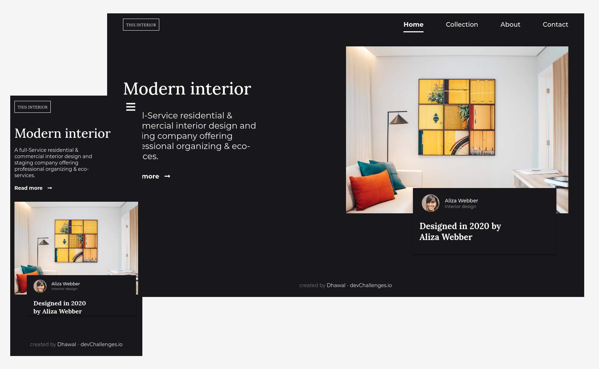

# :star2: devChallenges - Interior Consultant :star2:

Solution for a challenge from [Devchallenges.io](https://devchallenges.io).  
This application/site was created as a submission to a [DevChallenges](https://devchallenges.io/challenges) challenge. The [challenge](https://devchallenges.io/challenges/Jymh2b2FyebRTUljkNcb) was to build an application to complete the given user stories.

### :point_right: [Live Site](https://interior-consultant-challenge-4.netlify.app/)

## :camera: Overview

## :muscle: Built With

- HTML5 Semantics
- CSS3 (with Grid and Flexbox)
- SCSS

## :man: Author

- GitHub [@dhawalRath](https://{github.com/dhawalRath})
- Twitter [@dhawalRath](https://{twitter.com/dhawalRath})
